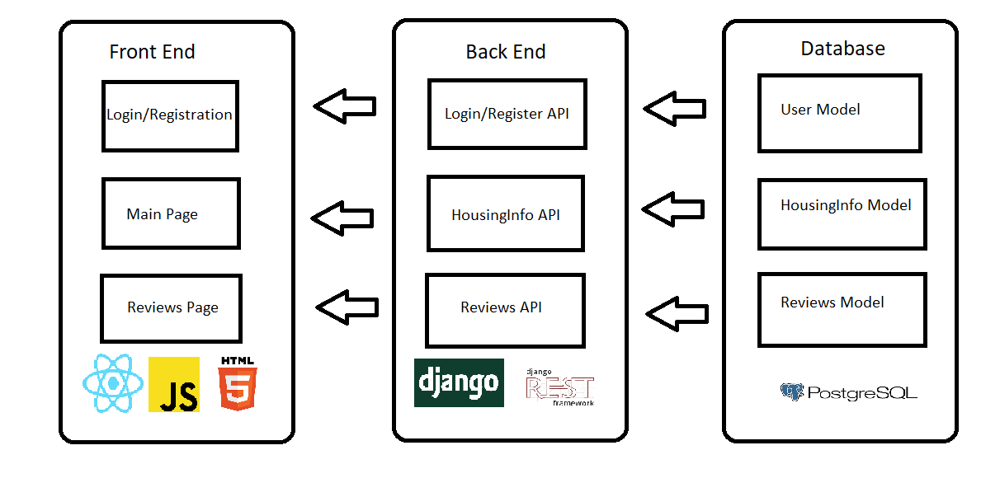

# MyHousing
MyHousing is a web app for finding and reviewing apartments in the Urbana-Champaign area. 

# Project Introduction
At the University of Illinois, finding housing in a decent location for the right price requires a lot of research and time. Even then, we have to compare the amenities and services each realty provides and that simply is too time-consuming and tedious for us students. To alleviate this stress, we want to create a centralized web application in which people can share their experiences and compare different housing options. 

We were partially inspired by websites like RateMyDorm. We realized RateMyDorm was limited in the types of housing that it showed. For example, RateMyDorm only lists information on dorms. We wanted to create an application that is tailored toward all available housing in the Urbana-Champaign area.

Our goals for the project are
 - Users can rate and share their experiences at a specific realty company or a specific apartment/dorm for others to see, where these reviews would be updated in real-time.
 - Gather data on each housing option’s pricing/reviews/location/realty reputation/etc. and visualize, using the Maps JavaScript API, that information onto a map so that users can quickly and effectively gauge which parts of town are the best fit for their needs.
 - Each user can create reviews for specific apartments they live in.

# Technical Architecture
 
We built our project using React with JavaScript for the frontend, Django for the backend, and PostgreSQL for the database.

We used various React libraries to provide the functionality to the frontend. For example, we used Axios to post data to the backend and Redux for authentication. We also used component libraries such as MUI and Bootstrap to simply implement certain components, such as the navigation bar and forms. For the map section of our web app, we used react-google-map api and the react-geocode api. The react-google-map api was used to load the map and place markers on the map corresponding to each of our apartments in the database. The react-geocode api was used to convert the street address into latitude and longitude. 

For the backend, we used the Django REST framework to handle the HTTP requests, user login, and registration (using tokens). We also used Django’s BaseCommand to create a wait_for_db() function which delays the start-up of our server until we have established a connection with the database. In the creation of our reviews, housingInfo, and user models, we used validators to validate the data that would be stored in our database. We used the test classes built into Django and the Django REST framework to test our code. We scraped multiple websites using an online tool to populate our initial database of housingInfos.

### Diagram


# Requirements
These are requirements to run the development website locally. Links to downloads are provided below.

- [Python](https://www.python.org/downloads/)
- [Node.js](https://nodejs.org/en/)
- [PostgreSQL](https://www.postgresql.org/download/)

# Installation
1. Install the requirements.
2. Clone the repository.
3. Navigate into the `course-project-group-15` folder that was created.
   ```console
   $ cd course-project-group-15
   ```
4. Create a virtual environment. 
   ```console
   $ python -m venv .venv
   ```
5. Activate the created virtual environment and install all the requirements in the `requirements.txt` file.
   ```console
   $ .\.venv\Scripts\activate
   $ pip install -r requirements.txt
   ```
6. Create a PostgreSQL database locally on your machine or in the cloud. 
7. Create a `.env` file in the root directory of the repo containing the necessary information needed to access the database. Your `.env` file should look something like this.
    ```
    NAME=database
    DB_USER=admin
    PASSWORD=1234
    HOST=localhost
    PORT=5432
    ```
At this point, the backend of the application should be fully set up.

# Usage 
To run the application, you will need to have the backend and frontend both running since the frontend fetches data from the backend.
### Starting the backend.
1. Activate the virtual environment.
   ```console
   $ .\.venv\Scripts\activate
   ```
2. Start the Django server. The `manage.py` file can be found in the `myHousing` folder.
   ```console
   $ cd .\myHousing
   $ python .\manage.py runserver
   ```
The Django server should now be running locally on your machine.

### Running the frontend.
1. Move into the `reactApp` directory.
  ```console
  $ cd .\course-project-group-15\myHousing\reactApp\
  ```
2. Run npm install if you are running the application for the first time.
  ```console
  $ npm install
  ```
3. Run npm start.
  ```console
  $ npm start
  ```
The react app should now be running on your local host. Go to http://localhost:3000.

# Populating Database
If you don't have any data in the PostgreSQL database or would like to upload your own data you can use the upload_data.py script located in the data folder of the repo. To run it, type the command below (you’ll need to be in the same directory).

  ```console
  $python upload_data.py
  ```
 Note: You may need to remove the authentication permission class in the housingInfo `views.py` for this script to work.
 
 # Group Info
- Group Name: course-project-group-15
- Members: 
  - Anirudh Ramesh (arame3)
  - Anish Thiriveedhi (anisht3)
  - Edwin Ing (edwinji2)
  - Justin (Kyuwon) Lee (kyuwonl2)

### Roles
Anirudh Ramesh and Anish Thiriveedhi worked on the frontend, developing most of the UI for the website using React. Anish focused on creating the housing list displayed on the home page, as well as the review page that displays users’ reviews. Both pages fetched their respective data from the backend. Additionally, he created frontend components that were globally used in the application such as the navigation bar. Edwin Ing and Justin (Kyuwon) Lee worked on the backend API to provide the frontend with information on apartments in the Urbana-Champaign area and a way to authenticate users. Edwin Ing mainly focused on developing the serializers and user authentication for the backend as well as gathering all the data on the apartments to populate the database. Edwin also worked on integrating the reviews API and authentication tokens with the frontend. Justin (Kyuwon) Lee focused on creating the database models, testing the models, integrating the backend with the frontend, and populating the map using react-geocode. Everyone contributed to implementing the project. 

